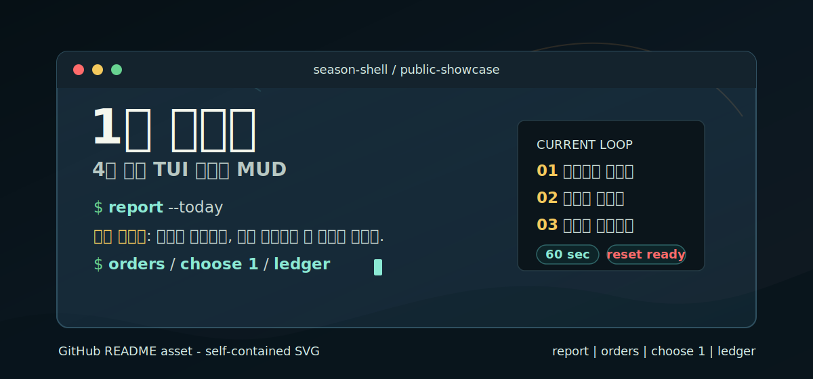
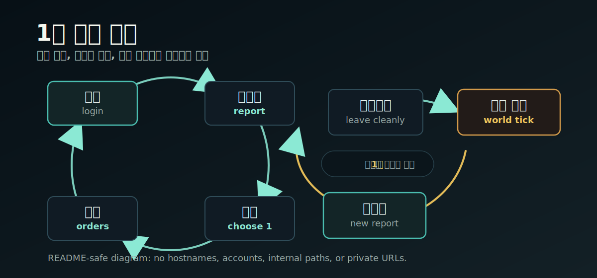
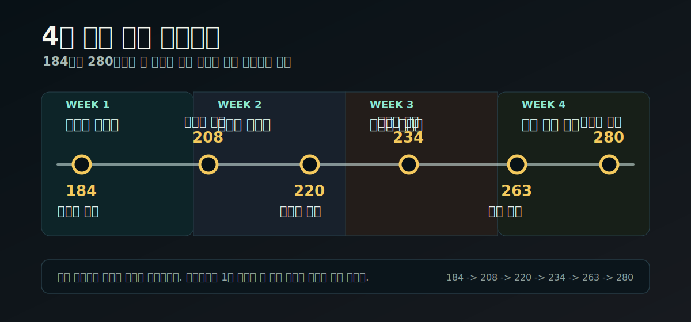

# One-Minute Three Kingdom



**One-Minute Three Kingdom**은 하루에 몇 번, 1분쯤 접속해서 난세의 보고를 읽고 하나의 판단을 남기는 삼국지 회귀 MUD입니다.

이 저장소는 별도 랜딩페이지가 아니라 공개 현관입니다. 과장된 출시 홍보보다 지금 플레이할 수 있는 형태, 아직 불안정한 부분, 참여하는 방법, 공개해도 되는 정보의 경계를 먼저 보여줍니다.

| 지금 상태 | 제한 초대 베타 |
| --- | --- |
| 주 플레이 표면 | SSH 위의 TUI |
| 보조 표면 | 웹 접속은 베타 안내가 공개하는 범위에서만 안내 |
| 플레이 리듬 | 짧은 접속, 보고 읽기, 선택 하나, 장부 확인 |
| 목표 | 수익화보다 오래 기억되는 작은 커뮤니티 |

```sh
ssh <player>@<beta-host>
```

실제 베타 host, 계정, 초대 정보는 초대된 테스터에게만 비공개로 전달됩니다. 공개 문서와 예시는 항상 placeholder를 사용합니다.

## 먼저 볼 곳

- [플레이 소개](docs/how-it-plays.md): 1분 접속이 실제로 어떻게 흐르는지 봅니다.
- [공개 상태](docs/status.md): 지금 베타에서 되는 것과 아직 약속하지 않는 것을 확인합니다.
- [베타 참여](docs/join-beta.md): 초대 요청이 열렸을 때 무엇을 보내면 되는지 봅니다.
- [세계관](docs/world.md): 신무장, 회귀, 작은 베타의 약속을 읽습니다.
- [공개 경계](docs/public-boundary.md): 무엇을 이 저장소에 공개하면 안 되는지 확인합니다.

## 어떤 경험인가요

플레이어는 조조, 유비, 손권 같은 유명 군주가 아니라 난세의 한 신무장으로 들어옵니다. 오래 붙잡고 앉아 모든 것을 해결하는 게임이 아니라, 짧게 들어와 지금 닿아 있는 상황을 읽고 다음 사람이 이어받을 수 있는 흔적을 남기는 게임입니다.

기본 루프는 작습니다.

1. `report`로 지금 벌어진 일을 읽습니다.
2. `orders`로 가능한 행동을 확인합니다.
3. `choose`로 하나를 고릅니다.
4. `ledger`로 남은 기록을 봅니다.
5. `logout`으로 물러납니다.

숫자 성장보다 중요한 것은 보고, 소문, 청원, 장부가 쌓이면서 플레이어들이 서로의 판단을 알아보는 감각입니다. 좋은 하루는 반드시 승전이 아니라, 근거 없는 소문을 그대로 군령으로 만들지 않은 선택일 수도 있습니다.



## 지금 만들고 있는 것

현재 목표는 "많은 사람을 한 번에 유입하는 공개 웹게임"이 아닙니다. 작은 초대 베타 안에서 다음 질문을 검증하는 중입니다.

- 1분 접속만으로도 진행감이 남는가.
- 자리를 비운 동안의 변화를 새 플레이어가 따라올 수 있는가.
- 비동기 경쟁이 커뮤니티 기억으로 남고, 과열과 괴롭힘으로 번지지 않는가.
- 보고, 청원, 소문, 장부가 세계를 읽기 쉽게 만드는가.
- 운영자가 작은 테스트를 지속 가능한 부담으로 관리할 수 있는가.

베타 중에는 명령어, 밸런스, 온보딩, 시즌 데이터가 바뀔 수 있습니다. 캐릭터와 기록의 영구 보존, 공개 업타임, 셀프서비스 가입, 유료 특전은 현재 약속하지 않습니다.

## 참여와 피드백

베타는 초대제로 운영됩니다. 커뮤니티가 너무 빨리 커지면 이 게임이 검증하려는 읽기 쉬운 기록, 느린 경쟁, 서로를 알아보는 감각이 먼저 무너질 수 있기 때문입니다.

참여 흐름은 단순합니다.

1. [베타 참여](docs/join-beta.md)를 읽습니다.
2. 공개 신청이 열리면 안내된 경로로 짧은 요청을 보냅니다.
3. 현재 테스트에 맞으면 비공개 초대 정보와 플레이어 이름을 받습니다.

좋은 피드백은 버그 제보만이 아닙니다. 명령어가 헷갈린 순간, 보고가 읽히지 않은 이유, 사회적 마찰이 생긴 장면, 다른 플레이어의 선택이 신경 쓰였던 순간도 중요합니다.

공개 문서나 이미지의 문제는 [GitHub Issues](../../issues)에 남길 수 있습니다. 실제 베타 접속, 계정, 초대 상태, 보안성 있는 내용은 공개 이슈에 쓰지 말고 초대 안내의 비공개 경로나 [Security Policy](SECURITY.md)를 따릅니다.

## 왜 README 중심인가요

공개 레포 README는 앱 랜딩페이지보다 표현력이 좁고 전환 추적도 약합니다. 대신 이 프로젝트에는 그 약점이 오히려 맞습니다.

- 지금 단계에서는 화려한 유입보다 신뢰가 중요합니다.
- 공개 문서가 곧 약속이 되므로 과장하기 어렵습니다.
- 상태, 참여 방식, 공개 경계를 같은 자리에서 읽을 수 있습니다.
- 플레이어와 기여자가 "무엇이 아직 실험인지"를 확인할 수 있습니다.

이 저장소는 전체 source release가 아닙니다. 실제 구현 저장소는 아직 비공개이며, 미공개 시나리오, 운영 판단, moderation, 악용 방지 세부 사항은 공개하지 않습니다. 지금 공개해야 할 것은 게임의 약속, 베타 상태, 참여 방법, 그리고 커뮤니티를 천천히 만드는 이유입니다.


